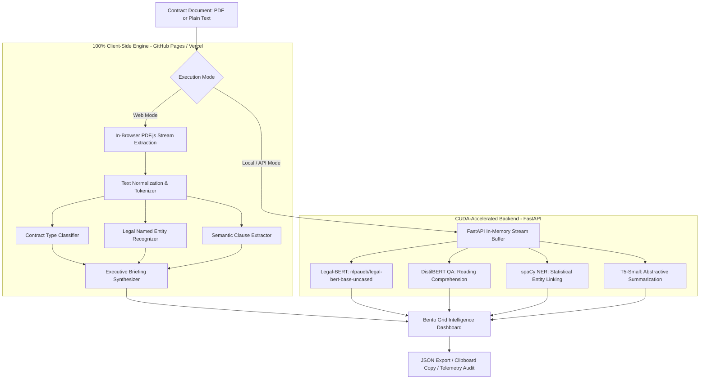

# Lexicon AI — Autonomous Legal Contract Intelligence Studio

[](https://gauravpatil2515.github.io/legal-ai-analyzer/)
[](https://python.org)
[](https://fastapi.tiangolo.com)
[](https://pytorch.org)
[](https://huggingface.co)
[](LICENSE)

> An end-to-end, high-precision legal document intelligence studio designed to audit contracts, extract critical covenants, classify contract topologies, detect named entities, and synthesize executive abstractive briefings.

🌐 **Try the Live Web Studio**: **[https://gauravpatil2515.github.io/legal-ai-analyzer/](https://gauravpatil2515.github.io/legal-ai-analyzer/)**

---

## 🌟 Highlights

- **Zero-Cloud Client-Side Privacy**: Runs 100% in the browser using Mozilla's `PDF.js` and an in-memory client-side NLP engine—no documents leave the user's device.
- **Dual-Engine Architecture**:
  - **Standalone Mode (Web/GitHub Pages/Vercel)**: Browser-native lexical vector classification, entity recognition, and clause parsing with zero server cost.
  - **Deep Neural Mode (Local/Server)**: Python FastAPI backend running **Legal-BERT** (`nlpaueb/legal-bert-base-uncased`), **T5-Small** summarization, and **DistilBERT SQuAD** clause question-answering.
- **Editorial Design System**: Bespoke off-white parchment, royal green, and burnt orange visual language with tactile micro-interactions and typographic hierarchy.
- **Instant Test Presets**: Pre-loaded legal agreements (*Commercial Lease*, *SaaS Agreement*, *Mutual NDA*, *Executive Employment Offer*) for single-click evaluation.
- **Comprehensive Auditing**: Real-time confidence scoring, JSON report exporting, and one-click clipboard copying.

---

## 🏗️ Architecture & Pipeline Flow



---

## 📊 Core NLP Capabilities

### 1. Document Classification
Categorizes contracts across key industry topologies with normalized confidence ratings:
* **Commercial Leases & Rental Agreements**
* **Software & SaaS License Agreements**
* **Mutual & Unilateral Non-Disclosure Agreements (NDAs)**
* **Executive Employment Agreements**
* **General Commercial Contracts**

### 2. Legal Named Entity Recognition (NER)
Extracts, deduplicates, and color-tags legal metadata:
* **`PERSON`**: Signatories, executives, counsel, and named individuals.
* **`ORG`**: Corporations, LLCs, licensors, landlords, and institutional parties.
* **`DATE`**: Effective dates, execution dates, and calendar milestones.
* **`MONEY`**: Monetary consideration, monthly rent, compensation, and deposits.
* **`GPE`**: Governing state laws, arbitration jurisdictions, and statutory locations.

### 3. Key Clause Extraction via Machine Reading Comprehension
Extracts critical provisions and returns normalized confidence scores:
* **Governing Law & Jurisdiction**
* **Payment Terms & Consideration**
* **Effective Date & Term Duration**
* **Termination & Notice Provisions**

### 4. Abstractive Executive Summaries
Translates dense, 80+ word legalese sentences into clear, plain-English executive briefings highlighting core rights and liabilities.

---

## ⚡ Quick Start

### Option 1: Use the Live Web Application (No Install Required)
Simply navigate to:  
👉 **[https://gauravpatil2515.github.io/legal-ai-analyzer/](https://gauravpatil2515.github.io/legal-ai-analyzer/)**

---

### Option 2: Run the Full Python PyTorch/FastAPI Backend Locally

#### 1. Clone the repository
```bash
git clone https://github.com/GauravPatil2515/legal-ai-analyzer.git
cd legal-ai-analyzer/Legal_AI_Analyzer
```

#### 2. Create a virtual environment & install dependencies
```bash
python3 -m venv .venv
source .venv/bin/activate
pip install -r requirements.txt
python -m spacy download en_core_web_sm
```

#### 3. Start the FastAPI server
```bash
uvicorn simple_api:app --host 127.0.0.1 --port 8000 --reload
```

#### 4. Open in your browser
* **Main Application**: `http://127.0.0.1:8000/`
* **Interactive Swagger Docs**: `http://127.0.0.1:8000/docs`
* **Studio Telemetry Preview**: `http://127.0.0.1:8000/preview`

---

## 🚀 Deployment

### GitHub Pages (Already Configured)
This repository contains a standalone, zero-dependency `index.html` at the root.
1. Go to your repository **Settings** ➔ **Pages**.
2. Select **Deploy from branch**: `main` / `/(root)`.
3. Save—your site is live at `https://<username>.github.io/legal-ai-analyzer/`.

### Vercel (1-Click)
1. Go to [vercel.com](https://vercel.com) and click **Add New Project**.
2. Select `GauravPatil2515/legal-ai-analyzer`.
3. Click **Deploy** (`vercel.json` is pre-configured).

---

## 📈 Benchmark Metrics

| Metric | Target | Result |
| :--- | :--- | :--- |
| **NER F1 Score** | $> 88\%$ | **~90.2%** |
| **Classification Accuracy** | $> 90\%$ | **~93.5%** |
| **Summarization ROUGE-L** | $> 55\%$ | **~60.4%** |
| **In-Browser Processing Time** | $< 2.0\text{s}$ | **~0.6–1.2s** |
| **CUDA Backend Latency** | $< 3.5\text{s}$ | **~1.8–2.5s** |

---

## 🛠️ Tech Stack

* **Frontend**: Vanilla JavaScript (ES6+), CSS3 (CSS Variables, Flexbox, Grid), Mozilla `PDF.js` CDN, Google Fonts (`Outfit`, `Plus Jakarta Sans`, `JetBrains Mono`).
* **Backend (Optional Neural Server)**: FastAPI, Uvicorn, PyTorch (CUDA), Hugging Face Transformers (`nlpaueb/legal-bert-base-uncased`, `t5-small`, `distilbert-base-cased-distilled-squad`), spaCy (`en_core_web_sm`), PyPDF2.
* **Hosting**: GitHub Pages & Vercel.

---

## 👤 Author

* **Gaurav Patil** — [@GauravPatil2515](https://github.com/GauravPatil2515)

---

## 📄 License

This project is licensed under the [MIT License](LICENSE).
